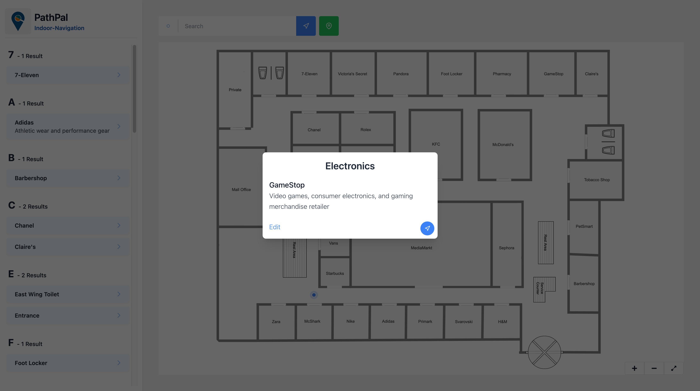
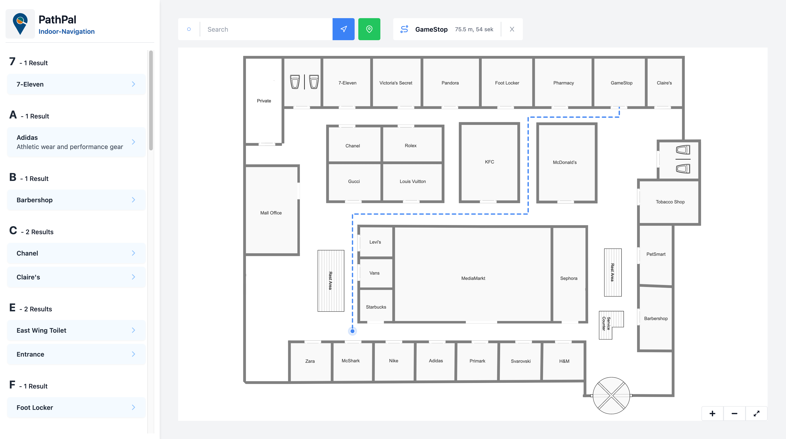
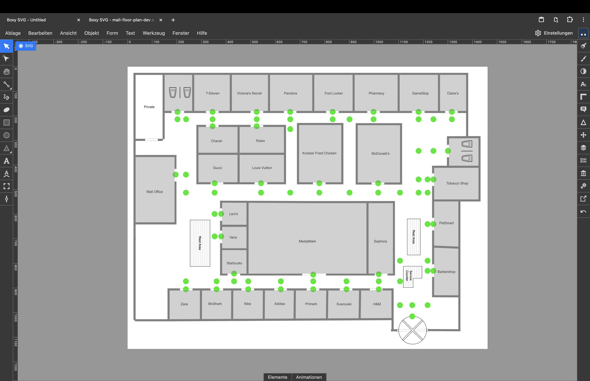

# TuJuanda: Navigasi Indoor Terminal 1 Bandara Juanda

**TuJuanda** adalah aplikasi web inovatif yang dirancang untuk merevolusi cara Anda bernavigasi di dalam Terminal 1 Bandara Internasional Juanda, Surabaya. Menggunakan peta interaktif dan algoritma pencarian rute yang efisien, aplikasi ini menawarkan solusi intuitif untuk menjelajahi ruang dalam ruangan yang kompleks.
<br>

## Daftar Isi:

- [TuJuanda: Navigasi Indoor Terminal 1 Bandara Juanda](#tujuanda-navigasi-indoor-terminal-1-bandara-juanda)
  - [Daftar Isi:](#daftar-isi)
  - [Tentang Aplikasi](#tentang-aplikasi)
  - [Tangkapan Layar](#tangkapan-layar)
  - [Fitur Utama](#fitur-utama)
  - [Teknologi yang Digunakan](#teknologi-yang-digunakan)
  - [Panduan Instalasi Lokal](#panduan-instalasi-lokal)
  - [Wawasan Teknis](#wawasan-teknis)
    - [Teknologi Peta](#teknologi-peta)
    - [Pencarian Rute (Pathfinding)](#pencarian-rute-pathfinding)
    - [Kustomisasi Peta](#kustomisasi-peta)
  - [Lisensi](#lisensi)

---

## Tentang Aplikasi

Proyek ini adalah sistem navigasi dan pencarian rute dalam ruangan (*wayfinding*) yang difokuskan pada denah **Terminal 1 Bandara Internasional Juanda**. Aplikasi ini menampilkan peta SVG interaktif dan memanfaatkan **Algoritma Dijkstra** untuk menghitung rute terpendek menuju berbagai tenant dan fasilitas (Points of Interest - POI) yang ada di dalam terminal.

---

## Struktur Proyek

> [!IMPORTANT]
> Proyek ini terdiri dari **dua repositori terpisah** yang bekerja bersamaan:
> 1.  `tujuanda-map` (proyek ini): Bertindak sebagai **frontend** yang menampilkan peta dan navigasi kepada pengguna.
> 2.  `admin-tujuanda`: Bertindak sebagai **backend** dan panel admin untuk mengelola data tenant, fasilitas, dan gambar yang disimpan di database.
>
> **Keduanya harus di-clone dalam satu folder induk yang sama agar dapat berfungsi dengan baik.**

---


## Tangkapan Layar

<table style="border-radius: 10px;  border: 1px solid gray;">
  <tr >
    <td align="center"> </td>
    <td align="center"><h3>Menampilkan Informasi Tenant/Fasilitas Saat Diklik</h3></td>
  </tr>
    <tr>
    <td align="center"> </td>
    <td align="center"><h3>Demonstrasi Perhitungan Rute Terpendek</h3></td>
  </tr>
</table>

---

## Fitur Utama

-   🗺️ **Peta SVG Interaktif**: Bernavigasi di dalam terminal bandara yang kompleks dengan mudah.
-   📍 **Pencarian Rute Dijkstra**: Menghitung jalur terpendek ke tujuan Anda secara akurat.
-   📱 **Desain Responsif**: Dioptimalkan untuk semua perangkat, baik desktop maupun mobile.
-   🏢 **Informasi Tenant dan Fasilitas**: Menampilkan detail nama, kategori, dan gambar untuk setiap titik penting.
-   👆 **Pinch-to-Zoom**: Memperbesar dan memperkecil peta dengan mudah menggunakan gestur sentuh.

---

## Teknologi yang Digunakan

Aplikasi ini dibangun dengan teknologi web modern untuk kecepatan, efisiensi, dan skalabilitas:

-   **React**
-   **Vite**
-   **TypeScript**
-   **TailwindCSS**
-   **SVG (Scalable Vector Graphics)**
-   **Algoritma Dijkstra**

---

## Panduan Instalasi Lokal

Ikuti langkah-langkah berikut untuk menjalankan proyek ini secara penuh di komputer Anda.

### Prasyarat
1.  **Proyek Backend**: Pastikan Anda sudah meng-clone proyek backend **"Admin TuJuanda"**.
2.  **Database**: Pastikan layanan database seperti **phpMyAdmin** (atau XAMPP) sudah berjalan dan database untuk proyek ini telah di-import.
3.  **Node.js**: Proyek ini memerlukan Node.js. Jika belum terinstal, unduh dari [nodejs.org](https://nodejs.org/).

### Struktur Folder
Agar frontend dapat berkomunikasi dengan backend, keduanya harus berada dalam satu folder induk yang sama.
/Proyek-Induk-Tujuanda/
├── admin-tujuanda/         # Folder backend
└── indoor-navigation/      # Folder ini (frontend)


### Langkah-langkah
1.  **Clone Repositori Frontend**:
    ```bash
    git clone [https://github.com/username/repo-name.git](https://github.com/username/repo-name.git) indoor-navigation
    ```

2.  **Install Dependensi**: Masuk ke direktori proyek frontend dan jalankan perintah:
    ```bash
    cd indoor-navigation
    npm install
    ```

3.  **Jalankan Aplikasi (Frontend & Backend)**: Untuk menjalankan kedua layanan secara bersamaan, gunakan perintah:
    ```bash
    npm run dev:all
    ```
    Perintah ini akan menjalankan server backend dari `admin-tujuanda` dan server frontend dari `indoor-navigation` secara bersamaan. Buka browser dan akses `localhost:5173` (atau port lain yang ditampilkan di terminal).

---

## Wawasan Teknis

### Teknologi Peta

-   **Format SVG**: Peta utama menggunakan format SVG karena fleksibilitas dan kemampuan interaktifnya, ideal untuk navigasi yang detail. Elemen di dalam SVG (seperti tenant atau fasilitas) dapat diidentifikasi dengan `id` unik.
-   **Dukungan Format Gambar**: Meskipun SVG adalah format utama, sistem ini dapat mendukung format gambar lain seperti PNG atau JPEG sebagai latar belakang peta.

### Pencarian Rute (Pathfinding)

-   **Definisi Rute (Edges)**: Jalur navigasi di dalam peta didefinisikan sebagai *edges* yang menghubungkan antar titik (vertices) dalam sebuah graf. Graf ini merepresentasikan semua rute yang bisa dilalui.
-   **Algoritma Dijkstra**: Aplikasi ini menggunakan implementasi Algoritma Dijkstra untuk secara akurat menghitung jalur terpendek dari satu titik ke titik lain berdasarkan graf yang telah didefinisikan di `src/store/graphData.ts`.

### Kustomisasi Peta

-   **Alat Edit**: Developer dapat menggunakan alat editor grafis vektor seperti **Inkscape**, **Adobe Illustrator**, atau **Boxy SVG** untuk memodifikasi file SVG peta. Modifikasi ini bisa berupa pembaruan tata letak, penambahan/penghapusan tenant, atau penyesuaian jalur.
-   **Konversi ke JSX**: Untuk mengubah SVG menjadi komponen React (JSX), Anda bisa menggunakan alat seperti [Transform Tools](https://transform.tools/).



---

## Lisensi

Proyek TuJuanda ini bersifat open-source di bawah **Lisensi MIT**. Kontribusi dan masukan sangat kami harapkan!